<table border="0">
  <tr>
    <td valign="center">
      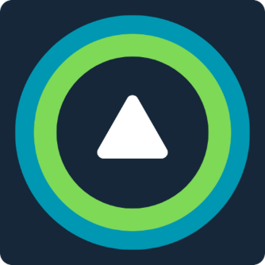
    </td>
    <td>
      <h1>ViviSense</h1>
      <blockquote>
        SIUE Senior Design Group 3 · Wheelchair Obstacle Dectection & Navigation Aid
      </blockquote>
    </td>
  </tr>
</table>

[](https://www.espressif.com/en/products/socs/esp32)
[](https://isocpp.org/)
[](https://www.python.org/)
[](https://www.espressif.com/en/solutions/low-power-solutions/esp-now)

---

## Project Overview

<p align="center">
  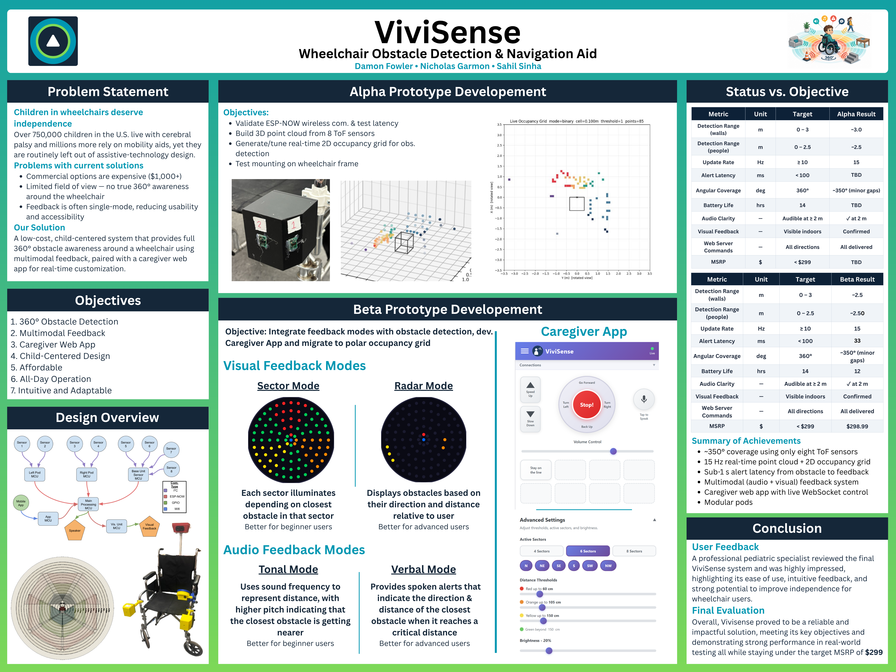
</p>

ViviSense is an obstacle-awareness system designed to improve the safety and independence of children who use wheelchairs. The system mounts eight [**VL53L7CX multizone Time-of-Flight (ToF) sensors**](https://www.pololu.com/product/3418) across two front armrest pods and a rear pentagonal tower, continuously mapping the surrounding environment into a **polar occupancy grid** (12 rings × 24 angular bins).

The system serves two distinct roles:

**Obstacle Detection** — real-time feedback delivered directly to the wheelchair user through two simultaneous channels:
- **An LED ring** mounted to the chair that shows direction and severity of nearby obstacles in two modes: Sector Mode and Radar Mode
- **Audio cues** in two modes — Tonal Mode (pitch rises as obstacles approach) and Verbal Mode (spoken directional alerts such as "Very close, ahead")

**Navigation Aid** — caregiver-facing tools for configuration, monitoring, and assisted control:
- **A caregiver web app** accessible over Wi-Fi, showing live sector status with configurable distance thresholds, sector count, visual and audio mode selection, and remote navigation commands

The core philosophy of the system is clean separation of concerns: sensors *measure*, `MainController` *decides*, and everything else *displays or controls*.

<p align="center">
  
</p>

> *ViviSense end-to-end system architecture.*

---

## The Design Journey

### Physical Design

Before any firmware was written, the physical sensor pod housings were designed in CAD and the sensor field-of-view coverage was mapped out to determine optimal mounting positions on the chair.

<table border="0">
  <tr>
    <td width="50%" align="center">
      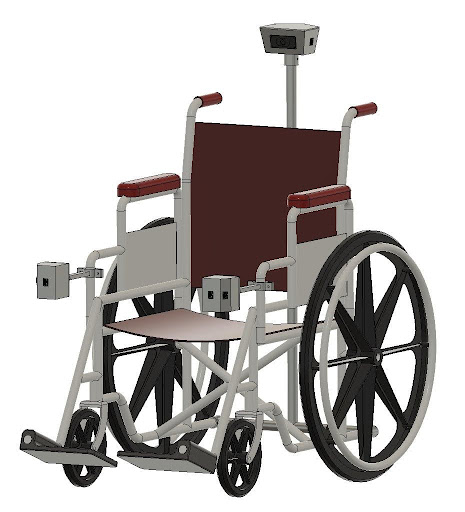
      <br><i>CAD model of the sensor pod enclosure (Fusion 360).</i>
    </td>
    <td width="50%" align="center">
      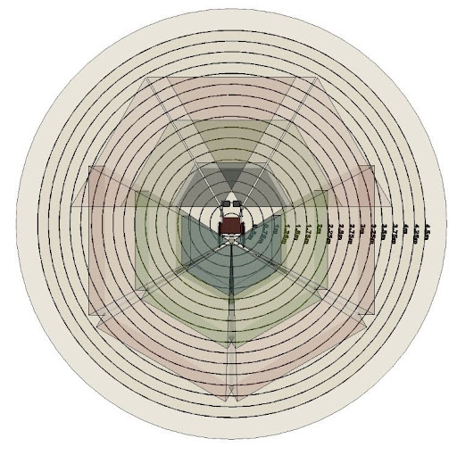
      <br><i>Sensor field-of-view coverage around the wheelchair.</i>
    </td>
  </tr>
</table>

---

### Pre-Alpha — Proving the Concept

The project started with a bench-top sensor validation rig. Before mounting anything to a wheelchair, we needed to confirm the ToF sensors could detect obstacles reliably and that ESP-NOW wireless communication between pods and the main controller was stable.

<table border="0">
  <tr>
    <td width="50%" align="center">
      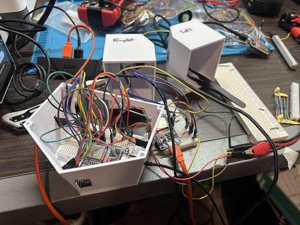
      <br><i>Early bench setup for sensor validation and firmware bring-up.</i>
    </td>
    <td width="50%" align="center">
      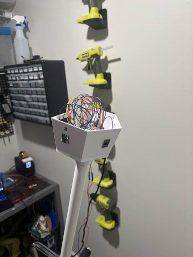
      <br><i>Testing point cloud geometry before mounting hardware to the chair.</i>
    </td>
  </tr>
</table>

---

### Alpha — First Hardware Integration

With sensor communication validated, we moved to integrating the pods onto an actual wheelchair. The alpha build introduced the physical sensor pod enclosures, the LED ring, and the first end-to-end run of the full pipeline — from raw ToF data all the way to lit LEDs on the chair.

<table border="0">
  <tr>
    <td width="33%" align="center">
      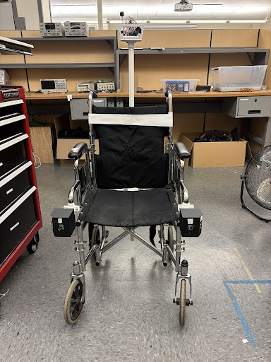
      <br><i>Alpha hardware integration — sensor pods and LED ring mounted to the chair.</i>
    </td>
    <td width="33%" align="center">
      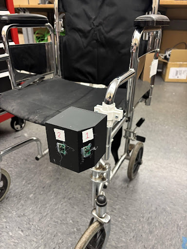
      <br><i>Full alpha system running for the first time with live obstacle feedback.</i>
    </td>
    <td width="33%" align="center">
      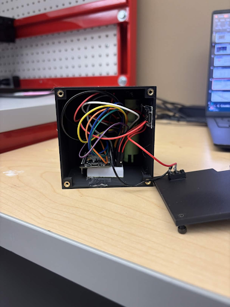
      <br><i>Inside a sensor pod — ToF sensor array and ESP32 module.</i>
    </td>
  </tr>
</table>

---

### Final System

The final design refined the physical pod enclosures (transitioned to soldered protoboard assemblies), migrated from a Cartesian to a polar occupancy grid, tuned hysteresis for stable real-world behavior, completed the caregiver web UI, and added full audio feedback in both Tonal and Verbal modes. The result is a fully integrated system that works across all three feedback channels simultaneously.

<p align="center">
  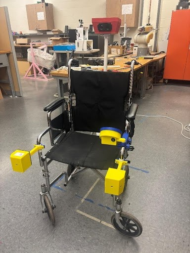
  <br><i>The completed ViviSense system on the final wheelchair.</i>
</p>

---

## How It Works

ViviSense processes obstacle data through a multi-stage pipeline:

1. **Sense** — Each sensor pod reads a 4×4 grid of distances from its VL53L7CX array at 15 Hz and transmits a `SensorPacket` wirelessly via ESP-NOW (average latency: 2.5 ms).
2. **Convert** — `MainController` receives packets and applies per-sensor extrinsic pose transforms (rotation matrix + translation offset) to convert each valid range cell into a world-frame 3D point relative to the wheelchair (`+X` forward, `+Y` left, `+Z` up).
3. **Filter** — Points outside the height window (configurable floor/ceiling cutoffs), below minimum distance, or with invalid target status are discarded.
4. **Classify** — Valid points are placed into a polar occupancy grid (12 rings × 24 angular bins). Each cell accumulates confidence over time through configurable rise/decay hysteresis, preventing flicker. The closest occupied distance per user-facing sector is mapped to one of four severity levels: 🔴 Red (≤ 60 cm), 🟠 Orange (≤ 105 cm), 🟡 Yellow (≤ 150 cm), 🟢 Green (> 150 cm).
5. **Output** — Occupancy drives the LED ring (Sector Mode or Radar Mode), audio proximity logic (Tonal Mode or Verbal Mode), and the caregiver web app simultaneously.

<table border="0">
  <tr>
    <td width="50%" align="center">
      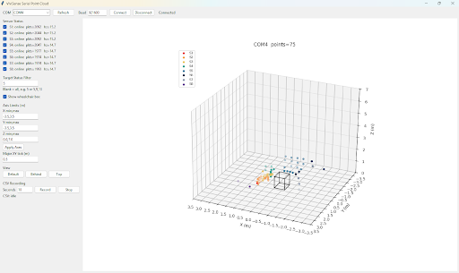
      <br><i>Live 3D point cloud — raw sensor data visualized in world-frame coordinates.</i>
    </td>
    <td width="50%" align="center">
      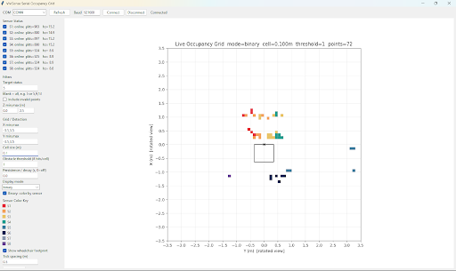
      <br><i>2D polar occupancy grid — each cell shows which sensor "owns" that zone.</i>
    </td>
  </tr>
</table>

### LED Display Modes

`MainController` supports two visual modes, both driven by the same polar occupancy grid:

<table border="0">
  <tr>
    <td width="50%" align="center">
      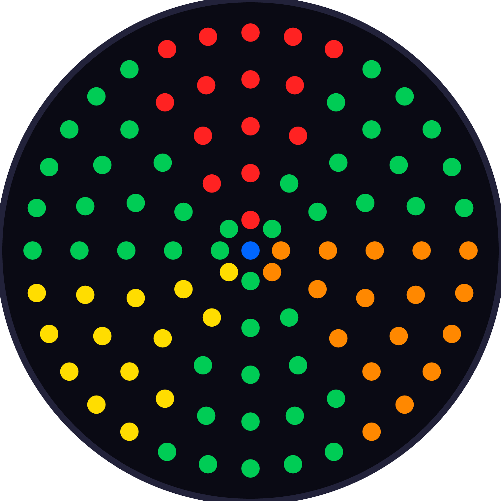
      <br><i><b>Sector Mode</b> — the ring is divided into angular sectors (4, 6, or 8). Each lights up with severity color based on the nearest obstacle in that direction. Recommended for beginner users.</i>
    </td>
    <td width="50%" align="center">
      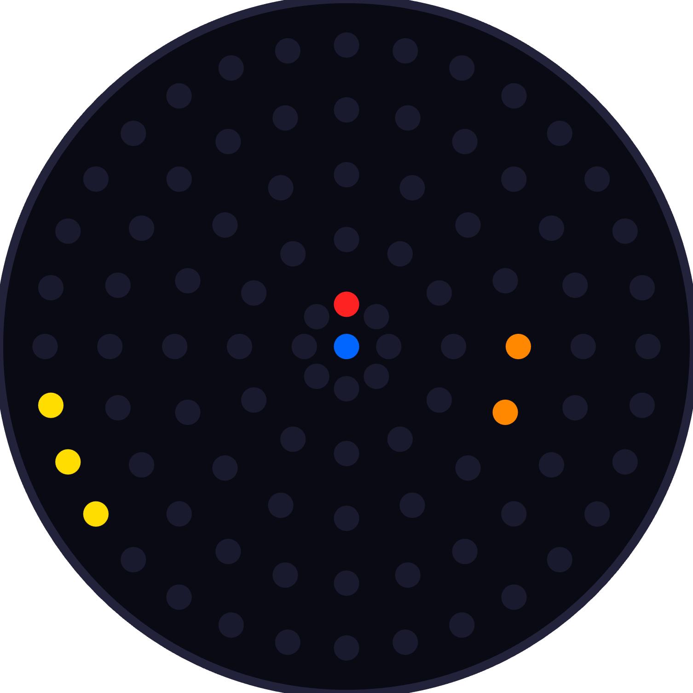
      <br><i><b>Radar Mode</b> — individual polar bins are drawn by angle and distance, giving a fine-grained sweep-like plan-view display. Recommended for advanced users.</i>
    </td>
  </tr>
</table>

<p align="center">
  
  <br><i>Live presentation viewer showing the occupancy grid updating in real-time.</i>
</p>

---

## Performance Summary

Beta testing validated the complete integrated system against all target specifications. Key results:

| Metric | Target | Beta Result |
| :--- | :--- | :--- |
| Detection range (walls) | 3.0 m | ~2.5 m |
| Detection range (people) | 2.5 m | ~2.5 m |
| End-to-end alert latency | < 100 ms | **33 ms** |
| Update rate | ≥ 10 Hz | **15 Hz** |
| Angular coverage | 360° | ~350° |
| ESP-NOW wireless latency | — | 2.5 ms avg / 4.2 ms max |
| System weight | < 5 lbs | **< 5 lbs** ✓ |
| Battery life | ≥ 14 hrs | ~12 hrs |
| Confirmed build cost | < $299 | **$298.99** ✓ |

---

## Tech Stack

| Layer | Technology |
| :--- | :--- |
| **Sensor Pods** | ESP32 + VL53L7CX multizone Time-of-Flight ranging arrays |
| **Wireless** | ESP-NOW (low-latency, connectionless; 2.5 ms avg latency) |
| **Main Controller** | ESP32 (C++ / PlatformIO) |
| **LED Ring** | WS2812B NeoPixel ring driven by a dedicated ESP32 |
| **Audio** | I2S class-D digital amplifier + 3 W speaker (Tonal & Verbal modes) |
| **Caregiver App** | ESP32 Wi-Fi AP + C++ WebSocket server + React/TypeScript SPA |
| **Visualization** | Python 3 (matplotlib, numpy, pyserial) |
| **CAD** | Fusion 360 |
| **Build System** | PlatformIO (firmware), npm (UI) |

---

## Repository Structure

| Folder | Purpose |
| :--- | :--- |
| [`/Software/ESP firmware`](./Software/ESP%20firmware) | All ESP32 firmware — main controller, sensor pods, LED ring, and presentation receiver |
| [`/Software/CaregiverApp`](./Software/CaregiverApp) | ESP32 Wi-Fi AP + React/TypeScript caregiver web interface |
| [`/Software/Visualizer`](./Software/Visualizer) | Python tools: point cloud, occupancy grid, polar grid, latency monitor |
| [`/mechanical`](./mechanical) | 3D print files (STEP/STL) for sensor pod housings |
| [`/simulation`](./simulation) | MATLAB point cloud and occupancy grid simulation |
| [`/.images`](./.images) | Project images and media |
| **[OneDrive Hub]** | [**Click here for OneDrive**](https://siuecougars-my.sharepoint.com/:f:/r/personal/dafowle_siue_edu/Documents/School/Fall%202025/Senior%20Design?csf=1&web=1&e=I8oYF6) |

---

## Getting Started

<details>
<summary><b>Click to expand: Full Setup Guide</b></summary>

### Prerequisites

- **VS Code** with the [PlatformIO IDE](https://platformio.org/) extension — for ESP32 firmware
- **Arduino IDE** — for LED ring and sensor pod firmware
- **Node.js / npm** — for building the caregiver React/TypeScript UI
- **Python 3.11+** — for the visualizer tools (`pip install -r Software/Visualizer/requirements.txt`)
- **MATLAB** — for the simulation (optional)

---

### 1. Build the Caregiver UI

```powershell
cd Software/CaregiverApp/ui
npm install
npm run build
```

---

### 2. Flash Firmware

**MainController** (PlatformIO):
```powershell
cd "Software/ESP firmware/MainController"
pio run -t upload
```

**CaregiverApp** (PlatformIO):
```powershell
cd Software/CaregiverApp
pio run -t upload
pio run -t uploadfs
```

**LEDRingController** — open and upload via Arduino IDE:
```
Software/ESP firmware/LEDRingController_ArduinoIDE/LEDRingController_ArduinoIDE.ino
```

**Sensor Pods** — open and upload via Arduino IDE:
```
Software/ESP firmware/LeftPodSender_ArduinoIDE/LeftPodSender_ArduinoIDE.ino
Software/ESP firmware/RightPodSender_ArduinoIDE/RightPodSender_ArduinoIDE.ino
```

---

### 3. Power-Up Order

1. LEDRingController
2. MainController
3. Left and right sensor pods
4. CaregiverApp
5. Connect phone/laptop to Wi-Fi: **`ViviSense`** / password **`ViviSense123`**
6. Open **`http://192.168.4.1`** in a browser

---

### 4. Run the Visualizer Tools

```powershell
cd Software/Visualizer
pip install -r requirements.txt

# Live polar grid presentation viewer
python serial_presentation_polar_grid_viewer.py --port COM5 --baud 230400

# Live point cloud
python serial_point_cloud_viewer.py --port COM5

# Playback from CSV recording
python playback_occupancy_grid_csv.py path/to/recording.csv
```

</details>

---

## Key Takeaways

<details>
<summary><b>Click to expand: Lessons Learned & Design Decisions</b></summary>

- **Polar-only architecture paid off.** Early iterations explored both Cartesian and polar obstacle models. Consolidating to a single polar occupancy grid (12 rings × 24 angular bins) simplified tuning significantly — one set of parameters now governs LED output, audio, and the visualizer simultaneously.

- **Hysteresis is essential.** Without confidence rise/decay on each occupancy cell, the LED ring flickered badly in real-world noise. The `polar_rise`/`polar_decay`/`polar_enter`/`polar_exit` parameter set made behavior dramatically more stable.

- **Separation of concerns between controllers mattered.** Keeping obstacle *logic* in `MainController` and obstacle *display* in `LEDRingController` made both easier to debug in isolation. A bad LED pattern could be traced to the render layer without questioning the detection pipeline.

- **Height filtering (`floor_z_mm` / `ceiling_z_mm`) is surprisingly impactful.** Without a ceiling cutoff, the sensors reliably detected the user's own arms and lap. Without a floor cutoff, floor-level reflections created phantom obstacles. Tuning the vertical window dramatically cleaned up real-world behavior.

- **4×4 mode outperforms 8×8 for real-world range.** Bench testing confirmed that 4×4 mode reliably detects walls to 3.0 m and people to 2.5 m. The 8×8 mode achieved only ~2.0 m (walls) and ~1.5 m (people) due to reduced per-zone signal energy.

- **ESP-NOW was the right wireless choice.** Its connectionless, broadcast nature meant sensor pods could start sending immediately without a pairing sequence. Measured latency was 2.5 ms average and 4.2 ms maximum — approximately 20× faster than the 100 ms end-to-end target.

- **The system reached $298.99 confirmed build cost**, meeting the sub-$299 target and validating ViviSense as a viable low-cost alternative to commercial systems costing $1,000–$6,000+.

- **External clinical validation:** A school-based Physical Therapist Assistant who reviewed the final system described it as having *"clear clinical relevance for pediatric and school-based populations, particularly for students developing spatial awareness and working towards independent mobility skills."*

</details>

---

## Further Reading

- [Software/SYSTEM_OVERVIEW.md](Software/SYSTEM_OVERVIEW.md) — Full architecture walkthrough and where to edit code
- [Software/RUNNING_THE_SYSTEM.md](Software/RUNNING_THE_SYSTEM.md) — Detailed bring-up checklist
- [Software/OCCUPANCY_GRID_TUNING_GUIDE.md](Software/OCCUPANCY_GRID_TUNING_GUIDE.md) — Parameter reference for tuning obstacle behavior
- [Software/AUDIO_FEEDBACK_PLAN.md](Software/AUDIO_FEEDBACK_PLAN.md) — Audio cue design and implementation notes
